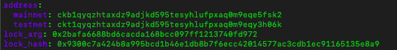

1. A screenshot of the accounts you created (account list) in ckb-cli.



2. A link to the Layer 1 address you funded on the Testnet Explorer.

https://explorer.nervos.org/aggron/address/ckt1qyqzhtaxdz9adjkd595tesyhlufpxaq0m9eqy3h06k

3. A screenshot of the console output immediately after you have successfully submitted a deposit to Layer 2.

``` unable to complete this task due to macOS version < 11... will continue on linux machine soon! ```
